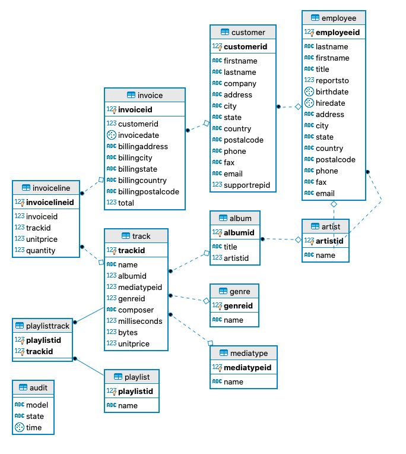

[](https://app.netlify.com/sites/dbtexample/deploys)

<!-- TOC depthFrom:1 depthTo:6 withLinks:1 updateOnSave:1 orderedList:0 -->

- [Purpose](#purpose)
- [Description of example](#description-of-example)
- [Pipeline Steps:](#pipeline-steps)
	- [On Pull Requests](#on-pull-requests)
	- [On Master](#on-master)
	- [How to share documentation.](#how-to-share-documentation)
- [More information](#more-information)

<!-- /TOC -->

# Purpose

The purpose of this repo is to showcase and explain the following:

* How to structure a DBT project.
* How to set up a CI/CD pipeline for DBT.
* How to share the DBT documentation for your project. You can find the documentation for this project [here](https://dbtexample.netlify.com/#!/overview).

# Description of example

For the purposes of testing the project, I set up a micro PostgresSQL instance on AWS. Ideally, you would have your own instance. I have loaded the Chinook data into the instance.



# Pipeline Steps:

## On Pull Requests
* First, the CI environment sets up all the dependencies.
* Run `dbt test` against your `sources` only. Note that we run tests for sources only because it allows us to verify the data integrity before we generate new models. In this context, a source is a table or collection of tables that get dumped into by the DB by some outside ETL system (e.g., Airflow, Dagster, Snowpipe, DMS, etc).
* Run `dbt run --target ci`. Ideally, the CI/CD environment will only run models that have been modified. DBT currently does not have this built out of the box. Note that this will not affect the production schema and the output of all the models will be available only to people who have access to development schema
* Run `dbt generate docs --target ci`. This will generate the static documentation, which will be hosted by Netfly in our example. You can replace the hosting to be done on S3. Since these are static files, they can literally be hosted anywhere.

## On Master
* The CI/CD pipeline on master is identical to the pull requests except everything is run with the flag `dbt run --target prod`


## How to share documentation.
* Create account on Netlify
* Set up a site. You can start the set up by dragging the folder `target` onto the generate site tool.
* Copy paste the code below into your github workflow:

```
name: Deploy Docs
  uses: nwtgck/actions-netlify@v1.0
  with:
    publish-dir: './target'
    production-branch: master
    deploy-message: "Deploy from GitHub Actions"
    github-token: ${{secrets.GITHUB_TOKEN}}
```

This will generate the dbt documentation for your project on every commit and will allow you to preview the docs. Only when the PR is merged to master the docs get deployed to production.


# More information
What is dbt?
Read the dbt viewpoint
Installation
Join the chat on Slack for live questions and support.
